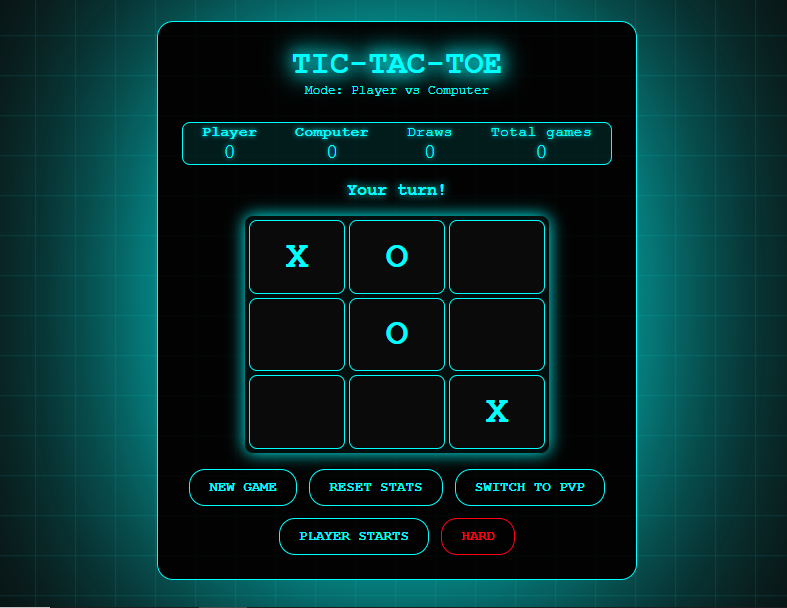

<div align="center"> 

# 🎮 Tic-Tac-Toe Game  

A modern, cyberpunk-styled Tic-Tac-Toe game with multiple game modes and difficulty levels.  

<a href="https://github.com/ivarssluka/tic-tac-toe/stargazers" target="_blank">
  
</a>
<a href="https://github.com/ivarssluka/tic-tac-toe/network/members" target="_blank">
  
</a>  

<br>

  
  
  

---

## 🚀 Live Demo  

<a href="https://dice.infy.uk/" target="_blank">
  
</a>
<br>
<a href="https://dice.infy.uk/" target="_blank">
  
</a>  
<br>
✨ <a href="https://dice.infy.uk/" target="_blank">Play the game here!</a>  

---
</div>

## ✨ Features  

* 🎯 Two game modes: **Player vs Computer** and **Player vs Player**  
* 🎮 Three difficulty levels: **Easy, Medium, Hard**  
* 📊 Statistics tracking for wins, losses, and draws  
* 🌟 Cyberpunk aesthetic with glowing effects and animations  
* 📱 Fully responsive design for mobile and desktop  
* 🔄 Option to choose who starts first  

---

## 🕹️ How to Play  

<details>
  <summary>Click to expand 📖</summary>

1. Select your preferred game mode (**PvC** or **PvP**)  
2. Choose difficulty level (Easy, Medium, or Hard) when playing vs Computer  
3. Select who starts first (Player or Computer in PvC, X or O in PvP)  
4. Click on an empty cell to place your mark  
5. Get **three in a row** horizontally, vertically, or diagonally to win  
6. Track your performance in the score panel  

</details>

---

## 🧠 Difficulty Levels  

* **Easy** → Computer makes random moves  
* **Medium** → Computer makes smart moves ~70% of the time, random ~30%  
* **Hard** → Computer always plays optimally (blocking, winning, center/corner preference)  

---

## 🛠️ Technologies Used  

* **HTML5**  
* **CSS3**
* **JavaScript**  

---

## 📂 File Structure  

```
tic-tac-toe/
├── index.html   # Main HTML file
├── styles.css   # CSS styles with animations
├── script.js    # Game logic and functionality
└── README.md    # Project documentation
```
---

## ⚡ Roadmap  

- [x] Player vs Player mode  
- [x] Player vs Computer mode  
- [x] Difficulty levels  
- [ ] Add online multiplayer  

---

## 🌐 Browser Compatibility  

This game works on all modern browsers:  

* Chrome (recommended)  
* Firefox  
* Safari  
* Edge  

---

## 🤝 Contributing  

Contributions are welcome! 🎉  

1. Fork the project  
2. Create a feature branch (`git checkout -b feature/YourFeature`)  
3. Commit your changes (`git commit -m 'Add some feature'`)  
4. Push to your branch (`git push origin feature/YourFeature`)  
5. Open a Pull Request  

---

## 🙏 Acknowledgments  

* Inspired by classic Tic-Tac-Toe games  
* Design inspired by **cyberpunk & retro-futuristic aesthetics**  

---

## 📬 Support  

If you have questions, open an issue on GitHub or contact me at **[slukaivars@gmail.com](mailto:slukaivars@gmail.com)**.  

---

✨ Enjoy the game and may the best player win! ✨  